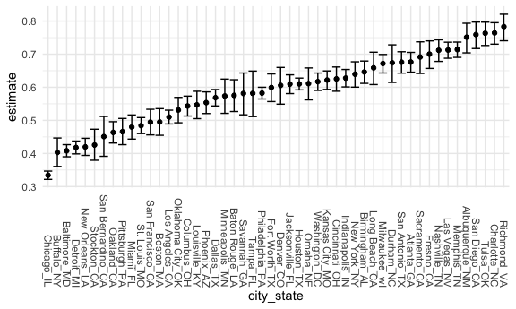

Homework 5
================
Bin Yang
11/10/2020

    library(tidyverse)

    ## ── Attaching packages ─────────────────────────────────────────────────────────────────── tidyverse 1.3.0 ──

    ## ✓ ggplot2 3.3.2     ✓ purrr   0.3.4
    ## ✓ tibble  3.0.3     ✓ dplyr   1.0.2
    ## ✓ tidyr   1.1.2     ✓ stringr 1.4.0
    ## ✓ readr   1.3.1     ✓ forcats 0.5.0

    ## ── Conflicts ────────────────────────────────────────────────────────────────────── tidyverse_conflicts() ──
    ## x dplyr::filter() masks stats::filter()
    ## x dplyr::lag()    masks stats::lag()

    library(rvest)

    ## Loading required package: xml2

    ## 
    ## Attaching package: 'rvest'

    ## The following object is masked from 'package:purrr':
    ## 
    ##     pluck

    ## The following object is masked from 'package:readr':
    ## 
    ##     guess_encoding

    knitr::opts_chunk$set(
      fig.width = 6,
      fig.asp = .6,
      out.width = "90%"
    )
    theme_set(theme_minimal() + theme(legend.position = "bottom"))
    options(
      ggplot2.continuous.colour = "viridis",
      ggplot2.continuous.fill = "viridis"
    )
    scale_colour_discrete = scale_color_viridis_d
    scale_fill_discrete = scale_fill_viridis_d

Problem 1
---------

    city_prop_test = function(df) {
      
      n_unsolved 
      n_total 
      
      prop.test(...)
    }

    homicide_df = 
      read_csv("./data/homicide-data.csv") %>% 
      mutate(
        city_state = str_c(city, state, sep = "_"),
        resolved = case_when(
          disposition == "Closed by arrest" ~ "unsolved", 
          disposition == "Closed without arrest" ~ "unsolved",
          disposition == "Open/No arrest" ~ "solved"
        )
      ) %>% 
      select(city_state, resolved) %>% 
      filter(city_state != "Tulsa_AL") 

    ## Parsed with column specification:
    ## cols(
    ##   uid = col_character(),
    ##   reported_date = col_double(),
    ##   victim_last = col_character(),
    ##   victim_first = col_character(),
    ##   victim_race = col_character(),
    ##   victim_age = col_character(),
    ##   victim_sex = col_character(),
    ##   city = col_character(),
    ##   state = col_character(),
    ##   lat = col_double(),
    ##   lon = col_double(),
    ##   disposition = col_character()
    ## )

    aggregate_df = 
      homicide_df %>% 
      group_by(city_state) %>% 
      summarize(
        hom_total = n(),
        hom_unsolved = sum(resolved == "unsolved")
      ) 

    ## `summarise()` ungrouping output (override with `.groups` argument)

    prop.test(
      aggregate_df %>% filter(city_state == "Baltimore_MD") %>% pull(hom_unsolved), 
      aggregate_df %>% filter(city_state == "Baltimore_MD") %>% pull(hom_total)) %>% 
      broom::tidy()

    ## # A tibble: 1 x 8
    ##   estimate statistic  p.value parameter conf.low conf.high method    alternative
    ##      <dbl>     <dbl>    <dbl>     <int>    <dbl>     <dbl> <chr>     <chr>      
    ## 1    0.408      94.9 1.99e-22         1    0.390     0.427 1-sample… two.sided

iteration:

    results_df =
      aggregate_df %>% 
      mutate(
        prop_tests = map2(.x = hom_unsolved, .y = hom_total, ~prop.test(x = .x, n = .y)),
        tidy_tests = map(.x = prop_tests, ~broom::tidy(.x))
      ) %>% 
      select(-prop_tests) %>% 
      unnest(tidy_tests) %>% 
      select(city_state, estimate, conf.low, conf.high)

    results_df %>% 
      mutate(city_state = fct_reorder(city_state, estimate)) %>% 
      ggplot(aes(x = city_state, y = estimate)) +
      geom_point() + 
      geom_errorbar(aes(ymin = conf.low, ymax = conf.high)) +
      theme(axis.text.x = element_text(angle = 270, vjust = 0.5, hjust=1))

Problem 2
---------

    path_df = 
      tibble(
      path = list.files("./data/p2")
    ) %>% 
      mutate(path = str_c("./data/p2/", path),
             data = map(.x = path, ~read_csv(.x)),
             path2 = list.files("./data/p2")) %>%
      separate(path2, c("group", "id")) %>% 
      unnest() %>% 
      select(id, group, everything()) %>% 
      select(-path) %>% 
      pivot_longer(
        week_1:week_8,
        names_to = "week",
        values_to = "observations"
      )

    ## Parsed with column specification:
    ## cols(
    ##   week_1 = col_double(),
    ##   week_2 = col_double(),
    ##   week_3 = col_double(),
    ##   week_4 = col_double(),
    ##   week_5 = col_double(),
    ##   week_6 = col_double(),
    ##   week_7 = col_double(),
    ##   week_8 = col_double()
    ## )
    ## Parsed with column specification:
    ## cols(
    ##   week_1 = col_double(),
    ##   week_2 = col_double(),
    ##   week_3 = col_double(),
    ##   week_4 = col_double(),
    ##   week_5 = col_double(),
    ##   week_6 = col_double(),
    ##   week_7 = col_double(),
    ##   week_8 = col_double()
    ## )
    ## Parsed with column specification:
    ## cols(
    ##   week_1 = col_double(),
    ##   week_2 = col_double(),
    ##   week_3 = col_double(),
    ##   week_4 = col_double(),
    ##   week_5 = col_double(),
    ##   week_6 = col_double(),
    ##   week_7 = col_double(),
    ##   week_8 = col_double()
    ## )
    ## Parsed with column specification:
    ## cols(
    ##   week_1 = col_double(),
    ##   week_2 = col_double(),
    ##   week_3 = col_double(),
    ##   week_4 = col_double(),
    ##   week_5 = col_double(),
    ##   week_6 = col_double(),
    ##   week_7 = col_double(),
    ##   week_8 = col_double()
    ## )
    ## Parsed with column specification:
    ## cols(
    ##   week_1 = col_double(),
    ##   week_2 = col_double(),
    ##   week_3 = col_double(),
    ##   week_4 = col_double(),
    ##   week_5 = col_double(),
    ##   week_6 = col_double(),
    ##   week_7 = col_double(),
    ##   week_8 = col_double()
    ## )
    ## Parsed with column specification:
    ## cols(
    ##   week_1 = col_double(),
    ##   week_2 = col_double(),
    ##   week_3 = col_double(),
    ##   week_4 = col_double(),
    ##   week_5 = col_double(),
    ##   week_6 = col_double(),
    ##   week_7 = col_double(),
    ##   week_8 = col_double()
    ## )
    ## Parsed with column specification:
    ## cols(
    ##   week_1 = col_double(),
    ##   week_2 = col_double(),
    ##   week_3 = col_double(),
    ##   week_4 = col_double(),
    ##   week_5 = col_double(),
    ##   week_6 = col_double(),
    ##   week_7 = col_double(),
    ##   week_8 = col_double()
    ## )
    ## Parsed with column specification:
    ## cols(
    ##   week_1 = col_double(),
    ##   week_2 = col_double(),
    ##   week_3 = col_double(),
    ##   week_4 = col_double(),
    ##   week_5 = col_double(),
    ##   week_6 = col_double(),
    ##   week_7 = col_double(),
    ##   week_8 = col_double()
    ## )
    ## Parsed with column specification:
    ## cols(
    ##   week_1 = col_double(),
    ##   week_2 = col_double(),
    ##   week_3 = col_double(),
    ##   week_4 = col_double(),
    ##   week_5 = col_double(),
    ##   week_6 = col_double(),
    ##   week_7 = col_double(),
    ##   week_8 = col_double()
    ## )
    ## Parsed with column specification:
    ## cols(
    ##   week_1 = col_double(),
    ##   week_2 = col_double(),
    ##   week_3 = col_double(),
    ##   week_4 = col_double(),
    ##   week_5 = col_double(),
    ##   week_6 = col_double(),
    ##   week_7 = col_double(),
    ##   week_8 = col_double()
    ## )
    ## Parsed with column specification:
    ## cols(
    ##   week_1 = col_double(),
    ##   week_2 = col_double(),
    ##   week_3 = col_double(),
    ##   week_4 = col_double(),
    ##   week_5 = col_double(),
    ##   week_6 = col_double(),
    ##   week_7 = col_double(),
    ##   week_8 = col_double()
    ## )
    ## Parsed with column specification:
    ## cols(
    ##   week_1 = col_double(),
    ##   week_2 = col_double(),
    ##   week_3 = col_double(),
    ##   week_4 = col_double(),
    ##   week_5 = col_double(),
    ##   week_6 = col_double(),
    ##   week_7 = col_double(),
    ##   week_8 = col_double()
    ## )
    ## Parsed with column specification:
    ## cols(
    ##   week_1 = col_double(),
    ##   week_2 = col_double(),
    ##   week_3 = col_double(),
    ##   week_4 = col_double(),
    ##   week_5 = col_double(),
    ##   week_6 = col_double(),
    ##   week_7 = col_double(),
    ##   week_8 = col_double()
    ## )
    ## Parsed with column specification:
    ## cols(
    ##   week_1 = col_double(),
    ##   week_2 = col_double(),
    ##   week_3 = col_double(),
    ##   week_4 = col_double(),
    ##   week_5 = col_double(),
    ##   week_6 = col_double(),
    ##   week_7 = col_double(),
    ##   week_8 = col_double()
    ## )
    ## Parsed with column specification:
    ## cols(
    ##   week_1 = col_double(),
    ##   week_2 = col_double(),
    ##   week_3 = col_double(),
    ##   week_4 = col_double(),
    ##   week_5 = col_double(),
    ##   week_6 = col_double(),
    ##   week_7 = col_double(),
    ##   week_8 = col_double()
    ## )
    ## Parsed with column specification:
    ## cols(
    ##   week_1 = col_double(),
    ##   week_2 = col_double(),
    ##   week_3 = col_double(),
    ##   week_4 = col_double(),
    ##   week_5 = col_double(),
    ##   week_6 = col_double(),
    ##   week_7 = col_double(),
    ##   week_8 = col_double()
    ## )
    ## Parsed with column specification:
    ## cols(
    ##   week_1 = col_double(),
    ##   week_2 = col_double(),
    ##   week_3 = col_double(),
    ##   week_4 = col_double(),
    ##   week_5 = col_double(),
    ##   week_6 = col_double(),
    ##   week_7 = col_double(),
    ##   week_8 = col_double()
    ## )
    ## Parsed with column specification:
    ## cols(
    ##   week_1 = col_double(),
    ##   week_2 = col_double(),
    ##   week_3 = col_double(),
    ##   week_4 = col_double(),
    ##   week_5 = col_double(),
    ##   week_6 = col_double(),
    ##   week_7 = col_double(),
    ##   week_8 = col_double()
    ## )
    ## Parsed with column specification:
    ## cols(
    ##   week_1 = col_double(),
    ##   week_2 = col_double(),
    ##   week_3 = col_double(),
    ##   week_4 = col_double(),
    ##   week_5 = col_double(),
    ##   week_6 = col_double(),
    ##   week_7 = col_double(),
    ##   week_8 = col_double()
    ## )
    ## Parsed with column specification:
    ## cols(
    ##   week_1 = col_double(),
    ##   week_2 = col_double(),
    ##   week_3 = col_double(),
    ##   week_4 = col_double(),
    ##   week_5 = col_double(),
    ##   week_6 = col_double(),
    ##   week_7 = col_double(),
    ##   week_8 = col_double()
    ## )

    ## Warning: Expected 2 pieces. Additional pieces discarded in 20 rows [1, 2, 3, 4,
    ## 5, 6, 7, 8, 9, 10, 11, 12, 13, 14, 15, 16, 17, 18, 19, 20].

    ## Warning: `cols` is now required when using unnest().
    ## Please use `cols = c(data)`

Problem 3
---------

    #data generating function 
    sim_data_fn = function(samp_size, mu = 0, sigma = 5) {
      
      sim_data = 
        tibble(
          x = rnorm(n = samp_size, mean = mu, sd = sigma)
        )
    }

    # simulation results
    sim_results = 
      tibble(mu = c(1,2,3,4,5,6)) %>% 
      mutate(
      output_lists = map(.x = mu, ~rerun(5000, sim_data_fn(30, mu = .x)))
            ) %>% 
      unnest() %>% 
      mutate(
        t_tests = map2(.x = output_lists, .y = mu, ~t.test(x = .x, mu = .y, conf.level = 0.95)),
        tidy_tests = map(.x = t_tests, ~broom::tidy(.x))
             ) %>% 
      unnest(tidy_tests) %>% 
      select(mu, estimate, p.value)

    ## Warning: `cols` is now required when using unnest().
    ## Please use `cols = c(output_lists)`
